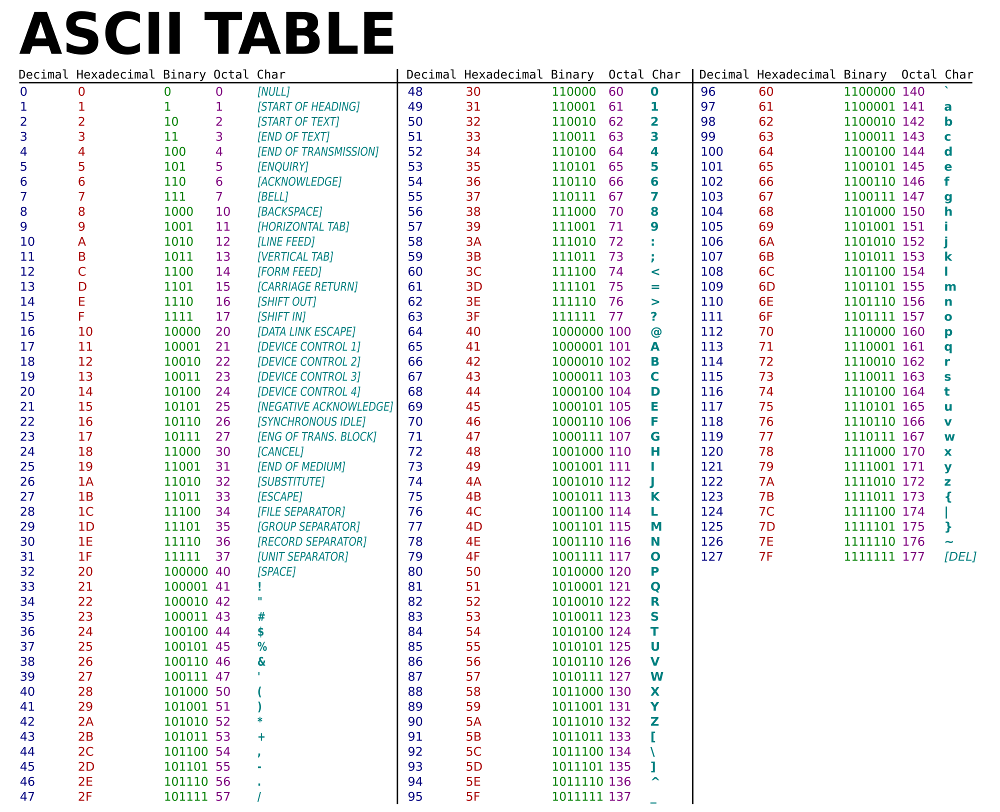

# Practical Scripting with Python
## UNO Summer Techademy

### Binary Numbers
| 27  | 26   | 25   |  24  | 23   | 22   |21   |20   |
|---|---|---|---|---|---|---|---|
| 128 | 64 | 32 | 16 | 8 | 4 | 2 | 1 |
| 0 | 0 | 0 | 0 | 0 | 0 | 0 | 0 |
| 1 | 1 | 1 | 1 | 1 | 1 | 1 | 1 |

- [Binary Game](https://studio.code.org/projects/applab/iukLbcDnzqgoxuu810unLw)

### Letters are Numbers (ASCII)

### Images are Numbers (RGB)
[How pixels are stored](https://youtu.be/15aqFQQVBWU)

## Steganography

Steganography is a method for concealing information within seemingly innocent media. The true craft comes from sending the information in a manner so that only the sender and the intended recipient realize its existence. Steganography may be as simple as altering the language of a message. It can also involve using a ""container", such as a jpg image, to carry a "cargo" of data, such as a text file. However the message is concealed, the art is in hiding the data in plain sight so as to hide its true intention. With steganography, seemingly unaltered images, video files, sound files, and even blank disc space can all inconspicuously carry extra data.

#### Example Techniques of Steganography
**Color -> Letter Conversion:**  
Colors:  Every color on a computer is represented as a mixture of red, green and blue colors.  Since everything is digital, at its rawest level, these colors are simply binary 0s and 1s.

Letters:  Similarly to colors, every letter on the keyboard or in a message has a binary representation based on the ASCII standard.  For example, the letter 'A' is the number 65 on the ASCII conversion chart.  One easy way to hide information in an image is to simply change an entire color to the number from a single letter.  For example, say you wanted to hide the message "Hello World" in an image.  We could find the ASCII value of each of those letters and change the Red value of every 13th pixel to match that data.  This method will leave visual artifacts of the modification.

**Least Significant Bit:** This method is much more difficult to detect but also more difficult to implement.  In the least significant bit (LSB) method, we change rightmost bit of each color to match our data.  For example in the pixel color  (Red = 178, Green = 216, Blue = 222) if we switch to the binary values we get: (10110010, 11011000, 11011110).  Since the letter 'H' is ASCII 72 is 01001000 in binary, we can begin hiding the data from this 'H' across the red, green and blue of many pixels in the rightmost bit by making this change: 10110010, 11011001, 11011110.  The next pixel would have the right three bits values be changed to **0, 1, 0** with the remaining values of H's ASCII in the next pixel's right most bits.  This process can be continued to hide an entire message.

### Steganography App
Our challenge today is to build a steganography app that can take a message and encode it into an image. Alternatively we want to be able to read an image and decode the hidden message.

#### Helper Functions
**numberToBinary(num)**  
The point of this function is to take a number in base 10 and convert it to a binary string. We will make the return value be a full byte (8-bits) and as a result the largest value that we will be able to convert is the number 255.
This type of precondition is a state that we expect for all values coming in. We could verify the number is in the range 0-255 but that is the stated expectation for anyone using our function.

- Why are we using a string result?
- How can we calculate a binary value in an algorithm?
- How do we ensure that the result is 8-bits, even if the number doesn't need that many bits?

**binaryToNumber(binaryString)**
This function will take a binary string and return a base 10 number.
- Working from right to left, is the last digit a 1 or a 0?
- Thinking back to our binary lesson, how can I calculate the value of each number?
- How do we know that we are done?

**textToNumbers(text)**
This function takes a string and returns a list of ASCII values.
- Go through every letter of the text.
- The ord(letter) function returns the ordinal (ASCII) value.
- To add a new item to a list use the list.append(item) function.

**numbersToText(nums)**
This function takes a list of ASCII values and returns a text string.
- Go through each list value
- Convert to letter and build message

**encode(img, message)**
This function will take an image and a message as parameters. We will then convert each letter in the message to binary. The binary values will be spread across the least significant bits (LSB) of the RGB values for the image.
- Since each letter takes 8 bits, how many pixels will we need per letter?
- Is there a maximum size to our message? How would we calculate that?
- How will we visit every pixel in an orderly way?
- When we are done with all the letters in a message, how do we stop the function?

When we have encoded the message in the image, we should save this new image to be loaded later.
